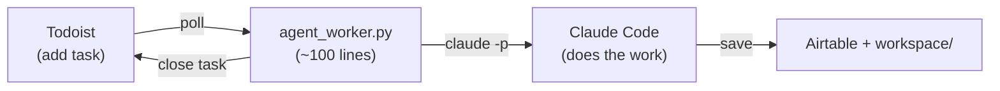

# Background Agents

Replace complex automation tools with ~100 lines of Python and Claude Code.



**The pattern**: A to-do app is the control plane. A Python script polls for tasks and dispatches them to Claude Code. Each Todoist project is an employee with a specific job.

**Read the full tutorial**: [docs/tutorial.md](docs/tutorial.md)

## Quick Start

```bash
# 1. Configure
cp .env.example .env
# Add TODOIST_API_TOKEN, AIRTABLE_API_KEY, AIRTABLE_BASE_ID

# 2. Create a project in Todoist
npm install -g @doist/todoist-cli
td auth login
td project create --name "LinkedIn Writer"

# 3. Add a task
td add "Why background agents beat chatbots" --project "LinkedIn Writer"

# 4. Run the worker
uv run tools/agent_worker.py --project "LinkedIn Writer"
```

## Multiple Employees

Each Todoist project is an employee. Run one worker per project:

```bash
uv run tools/agent_worker.py --project "LinkedIn Writer" --watch
uv run tools/agent_worker.py --project "Newsletter Writer" --watch
```

## Repo Structure

```
tools/agent_worker.py          # The worker (~100 lines)
.claude/skills/linkedin-post/  # LinkedIn writing skill + references
.claude/skills/airtable/       # Airtable CLI skill
.claude/agents/                # Agent definitions (writer + reviewer)
reference/                     # Brand voice, pillars, offers
docs/tutorial.md               # Full tutorial on the pattern
```
