# Background Agents

A secure, reliable alternative to OpenClaw in ~100 lines of Python.

You assign tasks from your phone. Agents do the work in the background. You review the results when you're ready.

## Three Levels of Working With AI

Most people are stuck at level one. This repo gets you to level two.

```mermaid
graph TD
    subgraph L1["🔴 Level 1: Micromanaging"]
        direction LR
        A1["You"] -- "prompt → response → prompt → ..." --> A2["AI"]
    end

    subgraph L2["🟢 Level 2: Delegating — this repo"]
        direction LR
        B1["You"] -- "assign task" --> B2["Worker"] -- "dispatch" --> B3["Agent"]
        B3 -. "draft ready" .-> B1
    end

    subgraph L3["🔵 Level 3: Running a Team"]
        direction LR
        C1["You"] -- "set goals" --> C2["Orchestrator"]
        C2 --> C3["Agent 1"]
        C2 --> C4["Agent 2"]
        C2 --> C5["Agent 3"]
    end

    L1 ~~~ L2 ~~~ L3

    style L1 fill:#fff5f5,stroke:#ef4444,stroke-width:2px
    style L2 fill:#f0fdf4,stroke:#22c55e,stroke-width:2px
    style L3 fill:#eff6ff,stroke:#3b82f6,stroke-width:2px
```



## How It Works

```mermaid
graph LR
    You["📱 You<br/>(phone, laptop, anywhere)"]
    Todoist["📋 Todoist<br/>(control plane)"]
    Worker["⚙️ Worker<br/>(Python script)"]
    Claude["🤖 Claude Code<br/>(does the work)"]
    Output["📦 Results<br/>(Airtable + workspace/)"]

    You -->|"add task"| Todoist
    Worker -->|"poll for tasks"| Todoist
    Worker -->|"claude -p"| Claude
    Claude -->|"save output"| Output
    Worker -->|"comment + label"| Todoist
    You -->|"review draft"| Output

    style You fill:#f5f5ff,stroke:#6366f1,stroke-width:2px
    style Todoist fill:#fef3c7,stroke:#f59e0b,stroke-width:2px
    style Worker fill:#f0fdf4,stroke:#22c55e,stroke-width:2px
    style Claude fill:#fdf2f8,stroke:#ec4899,stroke-width:2px
    style Output fill:#f0f9ff,stroke:#3b82f6,stroke-width:2px
```



Three components:

1. **Control plane (Todoist)** — You add tasks from your phone, laptop, anywhere. Each task is a job for the agent.
2. **Worker (Python script)** — Polls Todoist for new tasks. When it finds one, it passes the task straight to Claude Code. The polling is plain Python — zero tokens, zero cost. The agent only spins up when there's real work.
3. **Agent (Claude Code)** — Receives the task, does the work, saves output. The worker comments "done" on the ticket and tags it. The task stays open for you to review.

The worker is a dumb bridge. It doesn't decide what to do — it just passes your task to the agent. Claude Code reads its `CLAUDE.md` to figure out which skill to use. The intelligence lives in the agent, not the worker.

## OpenClaw vs This Approach

|  | OpenClaw | This repo |
|--|----------|-----------|
| **Control plane** | Custom Telegram bot | Todoist — battle-tested UI on every device |
| **Task queue** | Internal database / Redis | Todoist project — visual and auditable |
| **Worker** | Dockerised orchestration | Python script (~100 lines) |
| **Security** | Framework-level permissions | OS-level `--allowedTools` per task |
| **Cost model** | Always running | Polls with plain code, agent only when needed |

## Quick Start

```bash
# 1. Clone and configure
git clone https://github.com/owainlewis/agent-workers.git
cd agent-workers
cp .env.example .env
# Add TODOIST_API_TOKEN (required), AIRTABLE_API_KEY + AIRTABLE_BASE_ID (optional)

# 2. Add a task to Todoist
# Create a project called "Agent" in Todoist, then add a task via the app or CLI

# 3. Run the worker
uv run tools/agent_worker.py --project "Agent"
```

The worker finds the task, comments "working on it", dispatches to Claude Code, then comments "done" and adds the `agent-done` label. The task stays open — you review the output and close it yourself.

### Continuous polling

```bash
uv run tools/agent_worker.py --project "Agent" --watch
```

### Verbose mode (real-time progress on tickets)

```bash
uv run tools/agent_worker.py --project "Agent" --watch --verbose
```

In verbose mode, the worker posts live progress updates to the Todoist task as the agent works — reading files, writing drafts, pushing to Airtable.

## Multiple Agents

Each Todoist project is an employee. Run one worker per project:

```bash
uv run tools/agent_worker.py --project "LinkedIn Writer" --watch
uv run tools/agent_worker.py --project "Code Reviewer" --watch
uv run tools/agent_worker.py --project "Research" --watch
```

Your task manager becomes a dispatch centre for a team of agents.

## The Security Model

Every task runs with scoped permissions via `--allowedTools`:

```
--allowedTools Read Write Glob Grep "Bash(uv run:*)"
```

The agent can read and write files, search the codebase, and run `uv run` commands (for the Airtable CLI). No unrestricted shell, no network access, no `rm`. OpenClaw gives the agent access to everything. We give it access to exactly what the task needs.

## Trust and Verification

The agent drafts. You approve. The agent never publishes, merges, or sends anything directly. Output lands in `workspace/` and Airtable as a draft. You review and ship.

Start with low-stakes tasks — content drafts, research summaries, code review flags. Expand scope as you build confidence.

## Repo Structure

```
tools/agent_worker.py          # The worker (~100 lines)
tools/youtube.py               # YouTube transcript tool
CLAUDE.md                      # Agent instructions + skill routing
.claude/skills/linkedin-post/  # LinkedIn writing skill + references
.claude/skills/airtable/       # Airtable CLI skill
.claude/agents/                # Agent definitions
reference/                     # Brand voice, pillars, offers
workspace/                     # Agent output lands here
docs/tutorial.md               # Full tutorial
```

## Read More

**[Full tutorial →](docs/tutorial.md)** — Deep dive into the pattern, the worker design, adapting to different task queues and agents.
