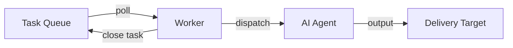
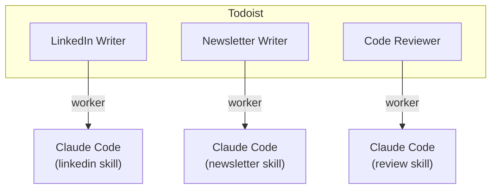
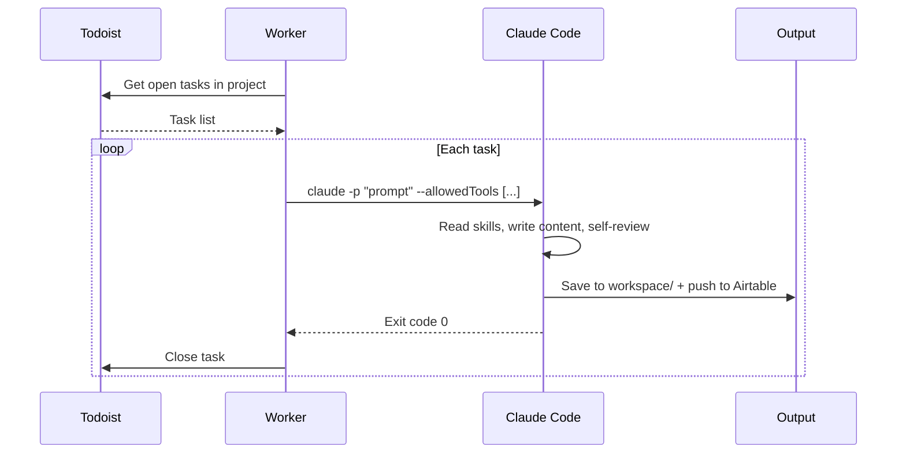

# Background Agents: The Pattern

You don't need a framework to run AI agents in the background. You need three things: a task queue, a worker, and an agent. This tutorial walks through the pattern and a working implementation in ~100 lines of Python.

## The Problem

Most AI agent demos are interactive. You sit in a chat window, type a prompt, wait for the response.

That's fine for exploration. But real work happens in the background. You want to add a task to a list and have it done by the time you check back. The same way you'd delegate to an employee.

The automation tools that solve this (Zapier, Make, n8n) are designed for deterministic workflows. Step 1 triggers Step 2 triggers Step 3. They weren't built for work that requires judgement — writing, reviewing, researching, coding.

AI agents can do that kind of work. The missing piece is the control plane — how you assign tasks, how the agent picks them up, and how the output gets delivered somewhere useful.

## The Pattern

Three components. That's it.



**Task Queue** — Where you add tasks. This is the control plane. It's how you tell agents what to do without sitting in a chat window.

**Worker** — A small script that polls the task queue, builds a prompt from each task, dispatches it to the agent, and marks the task complete when it's done.

**AI Agent** — The thing that actually does the work. In our case, Claude Code running with skill files that tell it how to write, review, and format content.

The worker is the glue. It's the only code you write. The task queue and the agent are off-the-shelf.

## Why a Task Queue?

You could trigger agents from a cron job, a webhook, or a Slack message. A task queue is better because:

1. **Visibility** — You can see what's pending, what's done, what failed. Open your phone, check the list.
2. **Retry** — Failed tasks stay open. The worker picks them up on the next run.
3. **Prioritisation** — Reorder tasks, add due dates, flag urgent work.
4. **Input from anywhere** — Add tasks from your phone, a browser extension, an API, or voice.
5. **Familiar interface** — You already know how to use a to-do app.

Any task management tool works. Todoist, Linear, Asana, GitHub Issues, a database table. The pattern is the same.

## The Mental Model: Projects as Employees

Think of each project in your task queue as an employee with a specific job.



Each project has its own worker process. Each worker dispatches to Claude Code with different skill files and permissions. The projects are independent — you can run one or all of them.

Adding a task is like walking up to an employee's desk and putting a sticky note on their monitor. The worker is the employee checking their desk for new notes.

## Implementation

This repo uses Todoist as the task queue and Claude Code as the agent. Here's how each piece works.

### 1. The Worker (~100 lines)

`tools/agent_worker.py` is the entire backend. It does four things:



The worker doesn't know anything about LinkedIn posts, content strategy, or Airtable schemas. It just:

1. **Polls** — Fetches open tasks from a Todoist project
2. **Builds a prompt** — Turns the task title + description into instructions
3. **Dispatches** — Runs `claude -p` with the prompt and scoped permissions
4. **Closes** — Marks the task complete in Todoist on success

That's the entire responsibility of the worker. The agent handles everything else.

### 2. The Agent (Claude Code + Skills)

Claude Code runs headless via `claude -p`. It receives:

- A prompt telling it what to do
- `--allowedTools` restricting what it can access
- `--model sonnet` for cost efficiency
- A working directory containing skill files and reference docs

The skill files (`.claude/skills/linkedin-post/SKILL.md`) are the real instructions. They define:

- How to write hooks, structure posts, match voice
- Reference files for brand, content strategy, examples
- An "autonomous mode" section — pick the best hook, skip waiting for input, self-review

The agent reads these files, follows the process, and saves output to `workspace/`.

### 3. The Security Model

Each dispatched task runs in a sandbox. The `--allowedTools` flag controls exactly what Claude Code can do:

```
--allowedTools Read Write Glob Grep "Bash(uv run:*)"
```

This means:
- **Read/Write/Glob/Grep** — File operations within the repo
- **Bash(uv run:\*)** — Only `uv run` commands (used for the Airtable CLI)

No unrestricted shell. No `rm`. No `curl`. No network access except through the Airtable CLI script. If the agent tries to run something outside this scope, it gets blocked.

This is important. You're running an AI agent unsupervised. Scoping its permissions is how you keep it safe.

### 4. The Delivery Target

After the agent finishes, output lands in two places:

- **`workspace/linkedin/`** — The draft file, saved locally
- **Airtable** — A record in the Content table with title, body, status, and platform

The Airtable push uses a CLI script (`.claude/skills/airtable/scripts/airtable.py`) that wraps the Airtable API. Claude Code calls it via `uv run`. No SDK, no API keys in the prompt — credentials live in `.env` and the script reads them.

## Running It

### Setup

```bash
# Clone the repo
git clone <repo-url>
cd background-agents

# Add your tokens
cp .env.example .env
# Edit .env with your TODOIST_API_TOKEN, AIRTABLE_API_KEY, AIRTABLE_BASE_ID

# Install the Todoist CLI (for adding tasks)
npm install -g @doist/todoist-cli
td auth login
```

### Create a project (your first "employee")

```bash
td project create --name "LinkedIn Writer"
```

### Add a task

```bash
td add "Why background agents beat chatbots for real work" --project "LinkedIn Writer"
```

### Start the worker

```bash
# Process once and exit
uv run tools/agent_worker.py --project "LinkedIn Writer"

# Or watch continuously
uv run tools/agent_worker.py --project "LinkedIn Writer" --watch
```

The worker finds the task, dispatches it to Claude Code, and closes it when done. Check `workspace/linkedin/` for the draft.

### Multiple employees

Run multiple workers in separate terminals:

```bash
# Terminal 1
uv run tools/agent_worker.py --project "LinkedIn Writer" --watch

# Terminal 2
uv run tools/agent_worker.py --project "Newsletter Writer" --watch
```

Each one watches its own project, dispatches with its own skills and permissions.

## Adapting the Pattern

### Different task queues

The pattern works with anything that has an API:

| Queue | How to poll | How to close |
|-------|-------------|--------------|
| Todoist | `todoist-api-python` SDK | `api.close_task()` |
| Linear | GraphQL API | Update issue status |
| GitHub Issues | `gh` CLI or REST API | Close issue |
| Airtable | Filter by status field | Update status to "done" |
| PostgreSQL | `SELECT WHERE status = 'pending'` | `UPDATE SET status = 'done'` |

Replace the `TodoistAPI` calls in the worker and the rest stays the same.

### Different agents

Claude Code is one option. The dispatch function just needs to run a subprocess:

```python
subprocess.run(["claude", "-p", prompt, ...])
```

You could swap in any agent that accepts a prompt via CLI:
- `codex` (OpenAI)
- A custom script that calls an API
- Another Claude Code instance with different skills

### Different outputs

The delivery target is whatever the agent's skill files tell it to do. Change the skill instructions and the output changes:

- Write to a database instead of Airtable
- Post directly to LinkedIn via API
- Create a PR on GitHub
- Send a Slack message

The worker doesn't care. It just dispatches and closes.

## Why This Works

The key insight is **separation of concerns**:

- **You** decide what needs doing (add a task)
- **The worker** handles lifecycle (poll, dispatch, close)
- **The agent** handles judgement (writing, reviewing, deciding)
- **Skill files** encode your standards (voice, structure, quality)

No framework. No orchestration platform. No YAML configs. A to-do app, a Python script, and an AI agent with good instructions.

The to-do app is the control plane you already use. The Python script is ~100 lines you can read in 5 minutes. The skill files are markdown documents that encode how you want work done. Everything is visible, editable, and debuggable.

That's the whole system.
