# Background Agents: The Pattern

You don't need a framework to run AI agents in the background. You need three things: a place to assign tasks, a worker script, and an agent. This tutorial walks through the pattern and a working implementation in ~100 lines of Python.

## The Problem

Most people are still using AI the old way — sitting in a chat window, prompting back and forth. That works for exploration. But it doesn't scale.

Real leverage comes from delegation. You assign a task, walk away, and come back to a finished draft. The same way you'd hand a brief to a team member.

The automation tools that try to solve this (Zapier, Make, n8n) are designed for deterministic workflows. Step 1 triggers Step 2 triggers Step 3. They weren't built for work that requires judgement — writing, reviewing, researching, coding.

AI agents can do that kind of work. The missing piece is the control plane — how you assign tasks, how the agent picks them up, and how the output gets delivered somewhere useful.

## Three Levels of Working With AI

There are three levels to how people work with AI agents. It maps to how managers work with people.

```mermaid
graph TD
    subgraph L1["Level 1: Micromanaging"]
        direction LR
        A1["You"] -- "prompt" --> A2["AI"]
        A2 -- "response" --> A1
    end

    subgraph L2["Level 2: Delegating ← this repo"]
        direction LR
        B1["You"] -- "assign task" --> B2["Worker"]
        B2 -- "dispatch" --> B3["Agent"]
        B3 -- "draft ready" --> B1
    end

    subgraph L3["Level 3: Running a Team"]
        direction LR
        C1["You"] -- "goals" --> C2["Orchestrator"]
        C2 --> C3["Agent 1"]
        C2 --> C4["Agent 2"]
        C2 --> C5["Agent 3"]
    end

    L1 ~~~ L2 ~~~ L3

    style L1 fill:#fee,stroke:#c33
    style L2 fill:#efe,stroke:#3a3
    style L3 fill:#eef,stroke:#33c
```



OpenClaw is a level two system. So is what we're building. The difference is ownership, security, and simplicity.

## The Pattern

When you decompose any level-two agent system, it has three components:

```mermaid
graph LR
    You["📱 You"]
    CP["📋 Control Plane"]
    W["⚙️ Worker"]
    Agent["🤖 AI Agent"]
    Out["📦 Results"]

    You -->|"add task"| CP
    W -->|"poll"| CP
    W -->|"dispatch"| Agent
    Agent -->|"save output"| Out
    W -->|"report status"| CP
    You -->|"review"| Out

    style You fill:#f5f5ff,stroke:#6366f1,stroke-width:2px
    style CP fill:#fef3c7,stroke:#f59e0b,stroke-width:2px
    style W fill:#f0fdf4,stroke:#22c55e,stroke-width:2px
    style Agent fill:#fdf2f8,stroke:#ec4899,stroke-width:2px
    style Out fill:#f0f9ff,stroke:#3b82f6,stroke-width:2px
```



**Control plane** — Where you assign tasks. This is how you tell agents what to do without sitting in a chat window.

**Worker** — A small script that polls the control plane, passes each task to the agent, and reports back with status updates. The worker is a dumb bridge — it doesn't decide what to do.

**AI Agent** — The thing that actually does the work. It reads the task, figures out the approach, and executes. The intelligence lives here, not in the worker.

Everything else — Docker containers, orchestration layers, plugin systems — is implementation detail.

## OpenClaw vs This Approach

Every component in OpenClaw is replaceable with something simpler and more secure:

|  | OpenClaw | This repo |
|--|----------|-----------|
| **Control plane** | Custom Telegram bot | Todoist — battle-tested UI on every device |
| **Task queue** | Internal database / Redis | Todoist project — visual and auditable |
| **Worker** | Dockerised orchestration | Python script (~100 lines) |
| **Security** | Framework-level permissions | OS-level `--allowedTools` per task |
| **Cost of polling** | Agent running continuously | Plain Python, zero tokens until real work |

The security difference matters. OpenClaw is an open-source framework with access to your codebase, APIs, and credentials. The security model is "trust this project." We use `--allowedTools` to scope exactly what the agent can access per task — OS-level sandboxing, not framework-level trust.

## Why a Task Queue?

You could trigger agents from a cron job, a webhook, or a Slack message. A task queue is better because:

1. **Visibility** — You can see what's pending, what's in progress, what's done. The agent comments on tasks as it works.
2. **Human review** — Completed tasks stay open with an `agent-done` label. You review the output and close the task yourself.
3. **Retry** — Failed tasks stay open without the label. The worker picks them up next run.
4. **Prioritisation** — Reorder tasks, add due dates, flag urgent work.
5. **Delegation from anywhere** — Add tasks from your phone, a browser, an API, or voice. Todoist has apps on every device.
6. **Familiar interface** — You already know how to use a to-do app.

Any task management tool works. Todoist, Linear, Asana, GitHub Issues, a database table. The pattern is the same.

## The Mental Model: Projects as Employees

Think of each project in your task queue as an employee with a specific job.

```mermaid
graph TD
    subgraph Todoist["📋 Todoist"]
        P1["LinkedIn Writer<br/>(3 tasks)"]
        P2["Code Reviewer<br/>(1 task)"]
        P3["Research<br/>(2 tasks)"]
    end

    P1 --> W1["⚙️ Worker"]
    P2 --> W2["⚙️ Worker"]
    P3 --> W3["⚙️ Worker"]

    W1 --> C1["🤖 Claude Code<br/>(linkedin skills)"]
    W2 --> C2["🤖 Claude Code<br/>(review skills)"]
    W3 --> C3["🤖 Claude Code<br/>(research skills)"]

    style Todoist fill:#fef3c7,stroke:#f59e0b,stroke-width:2px
    style W1 fill:#f0fdf4,stroke:#22c55e,stroke-width:2px
    style W2 fill:#f0fdf4,stroke:#22c55e,stroke-width:2px
    style W3 fill:#f0fdf4,stroke:#22c55e,stroke-width:2px
    style C1 fill:#fdf2f8,stroke:#ec4899,stroke-width:2px
    style C2 fill:#fdf2f8,stroke:#ec4899,stroke-width:2px
    style C3 fill:#fdf2f8,stroke:#ec4899,stroke-width:2px
```



Each project has its own worker. Each worker dispatches to Claude Code with different skills and permissions. Adding a task is like putting a brief on someone's desk.

## Implementation

This repo uses Todoist as the control plane and Claude Code as the agent. Here's how each piece works.

### 1. The Worker (~100 lines)

`tools/agent_worker.py` is the entire backend. It's deliberately simple — a dumb bridge between your to-do list and the agent.

The worker doesn't build complex prompts. It doesn't decide which skill to use. It takes the task title and description — the exact text you typed into Todoist — and passes it straight to Claude Code. The agent figures out what to do from its `CLAUDE.md`.

Core loop:

1. **Poll** — Fetch open tasks from a Todoist project (skip tasks labeled `agent-done`)
2. **Comment** — Post "working on it" so you can see progress in Todoist
3. **Dispatch** — Run `claude -p` with the task text and scoped permissions
4. **Report** — Comment "done" with a summary, add `agent-done` label
5. **Leave open** — You review the output and close it when you're satisfied

An important design decision: the polling is deterministic code — plain Python, no AI. It costs zero tokens. The agent only spins up when there's actual work to do. Cheap orchestration, expensive execution only when it matters.

### 2. The Agent (Claude Code + Skills)

Claude Code runs headless via `claude -p`. It receives:

- The task text as a prompt
- `--allowedTools` restricting what it can access
- `--model sonnet` for cost efficiency
- A working directory containing skill files and reference docs

The `CLAUDE.md` file is the agent's brain. It lists available skills, reference files, and rules for autonomous mode. When the agent receives a task, it reads `CLAUDE.md`, picks the right skill, and executes.

The skill files (`.claude/skills/linkedin-post/SKILL.md`) define the actual process — how to write hooks, structure posts, match voice, self-review.

### 3. The Security Model

Each dispatched task runs with scoped permissions:

```
--allowedTools Read Write Glob Grep "Bash(uv run:*)"
```

- **Read/Write/Glob/Grep** — File operations within the repo
- **Bash(uv run:\*)** — Only `uv run` commands (for the Airtable CLI)

No unrestricted shell. No `rm`. No `curl`. No network access except through scoped CLI scripts. If the agent tries to run something outside this scope, it gets blocked.

### 4. Verbose Mode (Real-Time Progress)

Run with `--verbose` and the worker posts live progress updates to the Todoist task:

```
📖 Reading skill: .claude/skills/linkedin-post/SKILL.md
📖 Reading reference: reference/brand.md
✍️ Writing workspace/linkedin/background-agents-draft.md
📤 Pushing to Airtable
✅ Done. Ready for review.
```

The worker parses Claude Code's streaming JSON output and translates tool calls into human-readable status lines. You can watch the agent work from your phone.

### 5. The Delivery Target

After the agent finishes, output lands in two places:

- **`workspace/linkedin/`** — The draft file, saved locally
- **Airtable** — A record in the content table with title, body, status, and platform

The Airtable push uses a CLI script that wraps the Airtable API. Credentials live in `.env`, never in prompts.

## Running It

### Setup

```bash
git clone https://github.com/owainlewis/agent-workers.git
cd agent-workers

cp .env.example .env
# Edit .env: add TODOIST_API_TOKEN (required)
# Optional: AIRTABLE_API_KEY, AIRTABLE_BASE_ID for content pipeline
```

### Create a project (your first "employee")

Create a project called "Agent" in Todoist (via the app or web).

### Add a task

Add a task to the Agent project from the Todoist app, web, or CLI:

> "Write a LinkedIn post about why background agents are more useful than chatbots"

### Run the worker

```bash
# Process once and exit
uv run tools/agent_worker.py --project "Agent"

# Watch continuously
uv run tools/agent_worker.py --project "Agent" --watch

# Watch with live progress on tickets
uv run tools/agent_worker.py --project "Agent" --watch --verbose
```

The worker picks up the task, dispatches to Claude Code, and comments back on the ticket when it's done. The task stays open — you review the draft in `workspace/linkedin/` or Airtable, then close the task yourself.

### Multiple employees

Run multiple workers in separate terminals:

```bash
uv run tools/agent_worker.py --project "LinkedIn Writer" --watch
uv run tools/agent_worker.py --project "Code Reviewer" --watch
```

Each one watches its own project with its own skills and permissions.

## Adapting the Pattern

### Different task queues

The pattern works with anything that has an API:

| Queue | How to poll | How to mark done |
|-------|-------------|-----------------|
| Todoist | `todoist-api-python` SDK | Add label + comment |
| Linear | GraphQL API | Move to "Review" status |
| GitHub Issues | `gh` CLI or REST API | Add label + comment |
| Airtable | Filter by status field | Update status to "review" |
| PostgreSQL | `SELECT WHERE status = 'pending'` | `UPDATE SET status = 'review'` |

Replace the `TodoistAPI` calls in the worker and the rest stays the same.

### Different agents

Claude Code is one option. The dispatch function just needs to run a subprocess:

```python
subprocess.run(["claude", "-p", prompt, ...])
```

The pattern works with any agent that accepts a prompt via CLI — the beauty is it's agent-agnostic.

### Different outputs

Change the skill files and the output changes. Write to a database, create a PR, post to Slack. The worker doesn't care — it just dispatches and reports back.

## Trust and Verification

The agent drafts. You approve. This is non-negotiable for unattended agents.

The agent never publishes, merges, or sends anything directly. There's always a gap between "agent did work" and "work reaches the real world." You sit in that gap.

**Start with low-stakes tasks.** Content drafts. Research summaries. Code review flags. Tasks where bad output costs you five minutes of review, not a production incident. Expand the scope as you build confidence.

**Scope the tools.** `--allowedTools` controls exactly what the agent can access. Start narrow.

**Budget ceilings.** Track token usage per task. Set a daily spend limit. You don't want to discover a runaway agent by looking at your API bill.

The honest truth: autonomous agents are best at work where you'd review the output anyway. Drafts, first passes, triage. The value isn't perfect work — it's that the work is waiting for you instead of starting from scratch.

## The Leverage Play

This isn't a developer tool. It's a leverage tool.

The people who figure out how to delegate to agents — not prompt them, delegate to them — are going to build disproportionately large businesses with disproportionately small teams.

Add three tasks from your phone over coffee. By the time you sit down at your desk, three drafts are waiting. Twenty minutes reviewing instead of three hours creating. That's leverage.

No framework. No orchestration platform. A to-do app, a Python script, and an AI agent with good instructions. That's the whole system.
